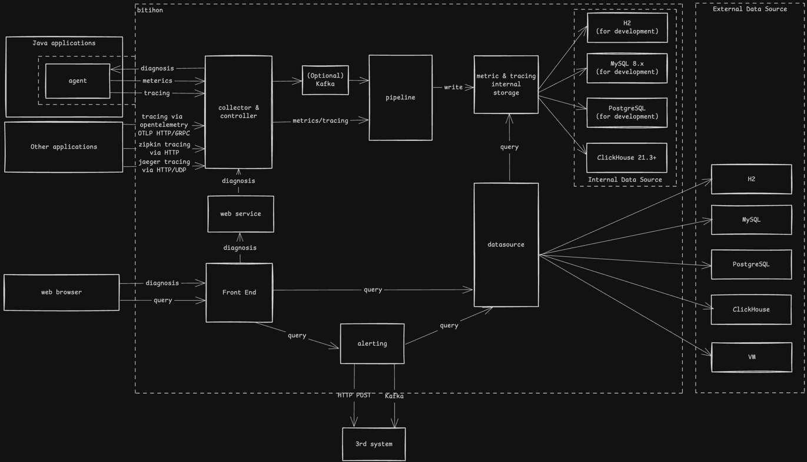

[](https://app.travis-ci.com/github/FrankChen021/bithon)

---

# Introduction

Bithon is a word combining binocular together with python.

It targets application metrics, logging, distributed tracing, alert and application risk governance under microservice environment.

## Architecture



The above pic illustrates the main components of this project, including:
- Agent, which collects metrics/tracing logs automatically from client application without any code modification at the application side
- Collector, which provides various interfaces (including OpenTelemetry GRPC interface) to receive metrics/tracing logs from clients
- Pipeline, which provides a flexible and robust way to hande small data scale to a very huge data scale for incoming metrics or tracing logs
- Storage, which provides an abstraction to underlying storages like H2, MySQL or Clickhouse
- Alerting, which allows us to set up alerts by using MetricSQL style expression on existing metrics or tracing logs
- Web, which provides a simple web portal for metrics/tracing log visualization 

## Highlights

- Around 200 built-in metrics for various JDK or various Java middlewares like Apache Http Components
- Open Telemetry Tracing standard support and integration
- Built-in debugging diagnosis commands for target application
- Flexible deployment to adapt small data scale and huge data scale use cases
- Fast queries and very low storage cost benefit from ClickHouse
- PromQL style alerting expression support

Reference:
- [White Paper](doc/misc/white-paper.md)
- [How does the agent work?](doc/misc/rationale/index.md)
- [What's the difference between Jaeger and Bithon?](doc/misc/comparison/jaeger/index.md) 
- [What's the difference between OpenTelemetry and Bithon?](doc/misc/comparison/opentelemetry/index.md)

# Demo

A demo is provided by this [demo repo](https://github.com/FrankChen021/bithon-demo) with a docker-compose file.
You can follow the README on that demo repo to start the demo within just 3 steps.

# Build

## 1. clone source code

After cloning this project, remember to clone the submodules by following command

```bash
git submodule update --init
```

## 2. choose a right JDK

JDK 1.8 is recommended because the agent is compatible with higher JRE that is used to run your Java applications.

If you have multiple JDKs on your machine, use `export JAVA_HOME={YOUR_JDK_HOME}` command to set correct JDK.

For example

```bash
export JAVA_HOME=/Library/Java/JavaVirtualMachines/openjdk-8.jdk/Contents/Home
```

## 3. build the project

For the first time to build this project, use the following command to build dependencies first: 

```bash
mvn clean install --activate-profiles shaded,jooq
```

and then execute the following command to build the project. 

```bash
mvn clean install -DskipTests
```

After the first build, we don't need to build the dependencies anymore unless there are changes in these dependencies.

# Run

Once the project has been built, you could run the project in a standalone mode to evaluate this project.

## 1. Launch the server all in one

To launch server in evaluation mode, execute the following command:

```bash
java -Dspring.profiles.active=all-in-one -jar server/server-starter/target/server-starter.jar
```

By default, the application opens and listens on following ports at local

| Function | Port |
|----------|------|
| tracing  | 9895 |
| event    | 9896 |
| metric   | 9898 |
| ctrl     | 9899 |
| web      | 9897 |

Once the application has started, visit [http://localhost:9897/web/home](http://localhost:9897/web/home) to view the monitor.

> Note:
> `-Dspring.profiles.include` parameter here is just for demo.
> 
> You can make changes to `server/server-starter/src/main/resources/application.yml` to reflect your own settings.
> 
> You can also use enable [Alibaba Nacos](doc/configuration/server/configuration-nacos.md) as your configuration storage center.

## 2. Attach agent to your java application

Attach agent to your java agent by adding the following VM arguments.

```bash
-javaagent:<YOUR_PROJECT_DIRECTORY>/agent/agent-distribution/target/agent-distribution/agent-main.jar -Dbithon.application.name=<YOUR_APPLICATION_NAME> -Dbithon.application.env=<YOUR_APPLICATION_ENV>
```

| Variable               | Description                                                                                                              |
|------------------------|--------------------------------------------------------------------------------------------------------------------------|
| YOUR_PROJECT_DIRECTORY | the directory where this project saves                                                                                   |
| YOUR_APPLICATION_NAME  | the name of your application. It could be any string                                                                     |
| YOUR_APPLICATION_ENV   | the name of your environment to label your application. It could be any string. Usually it could be `dev`, `test`, `prd` |

By default, the agent connects collector running at local(127.0.0.1). 
Collector address could be changed in file `agent/agent-main/src/main/resources/agent.yml`.
Make sure to re-build the project after changing the configuration file above.

# JDKs Compatibility

The following matrix lists the JDKs that have been tested on macOS. And in theory, this matrix works both for Windows and Linux.

| JDK           | Supported | 
|---------------|-----------|
| JDK 1.8.0_291 | &check;   |
| JDK 9.0.4     | &check;   |
| JDK 10.0.2    | &check;   |
| JDK 11.0.12   | &check;   |
| JDK 12.0.2    | &check;   |
| JDK 13.0.2    | &check;   |
| JDK 14.0.2    | &check;   |
| JDK 15.0.2    | &check;   |
| JDK 16.02     | &check;   |
| JDK 17        | &check;   |
| JDK 21        | &check;   |

## JDK 11 and above

If the target application runs under JDK 11 and above, the following arguments should be added to JVM command to allow the agent to use Java Reflection on corresponding packages.

```text
--add-exports=java.base/jdk.internal.misc=ALL-UNNAMED --add-exports=java.base/sun.net.www=ALL-UNNAMED
```

# Supported Components

| Component              | Min Version | Max Version | Metrics                                        | Tracing |
|------------------------|-------------|-------------|------------------------------------------------|---------|
| JVM                    | 1.8         |             | &check;                                        |         |
| JDK - Thread Pool      | 1.8         |             | &check;                                        |         |
| JDK - HTTP Client      | 1.8         |             | [&check;](doc/metrics/http-outgoing/README.md) | &check; |
| Alibaba Druid          | 1.0.28      |             | &check;                                        |         |
| Apache Druid           | 0.16        | 24.0        |                                                | &check; |
| Apache Kafka           | 0.10        |             | &check;                                        | &check; |
| Apache OZone           | 1.3.0       |             |                                                | &check; |
| Eclipse Glassfish      | 2.34        |             |                                                | &check; |
| GRPC                   | 1.6.0       |             | &check;                                        |         |
| Google Guice           | 4.1.0       |             |                                                | &check; |
| HTTP Client - Apache   | 4.5.2       | 5.x         | [&check;](doc/metrics/http-outgoing/README.md) | &check; |
| HTTP Client - Jetty    | 9.4.6       |             | [&check;](doc/metrics/http-outgoing/README.md) | &check; |
| HTTP Client - Netty    | 3.10.6      | < 4.0       | [&check;](doc/metrics/http-outgoing/README.md) | &check; |
| HTTP Client - okhttp3  | 3.2         | 4.9         | [&check;](doc/metrics/http-outgoing/README.md) | &check; |
| Jersey                 | 1.19.4      |             |                                                | &check; |
| MongoDB                | 3.4.2       |             | &check;                                        |         |
| MySQL                  | 5.x         | 8.x         | &check;                                        |         |
| Quartz                 | 2.x         |             | &check;                                        | &check; |
| Redis - Jedis          | 2.9         | 5.x         | &check;                                        | &check; |
| Redis - Lettuce(1)     | 5.1.2       | 6.x         | &check;                                        | &check; |
| Redis - Redisson       | 3.19.0      |             | &check;                                        | &check; |
| Spring Boot            | 1.5         | 3.0+        |                                                | &check; |
| Spring Bean            | 4.3.12      |             |                                                | &check; |
| Spring Open Feign      | 10.8        |             |                                                | &check; |
| Spring Rest Template   | 4.3.12      |             |                                                | &check; |
| Spring Scheduling      | 4.3.12      |             |                                                | &check; |
| Spring WebFlux         | 5.0.0       |             | [&check;](doc/metrics/http-outgoing/README.md) | &check; | 
| HTTP Server - Jetty    | 9.4.41      |             | &check;                                        | &check; |
| HTTP Server - Netty    | 2.0.0       |             |                                                | &check; |
| HTTP Server - Tomcat   | 8.5.20      |             | &check;                                        | &check; |
| HTTP Server - Undertow | 1.4.12      |             | &check;                                        | &check; |
| xxl-job                | 2.3.0       |             |                                                | &check; |

## Restrictions
1. For Lettuce, the tracing support is only available when it's used with Spring Data Redis API.
2. For Redisson, metrics and tracing only work when connections are successfully established between the client and redis servers.


# User Doc
1. [Metrics](doc/metrics/README.md)
2. [Tracing](doc/tracing/README.md)
3. [Logging](doc/logging/README.md)
4. [Diagnosis](doc/diagnosis/README.md)
5. [Configuration](doc/configuration/configuration.md)
6. SDK
   1. [Metrics](doc/sdk/metrics.md)
   2. [Tracing](doc/sdk/tracing.md)

# Contribution

To develop for this project, intellij is recommended.

A code style template file(`dev/bithon_intellij_code_style`) must be imported into intellij for coding.

For more information, check the [development doc](doc/dev/development.md).

# License

[Apache License, Version 2.0](http://www.apache.org/licenses/LICENSE-2.0)
