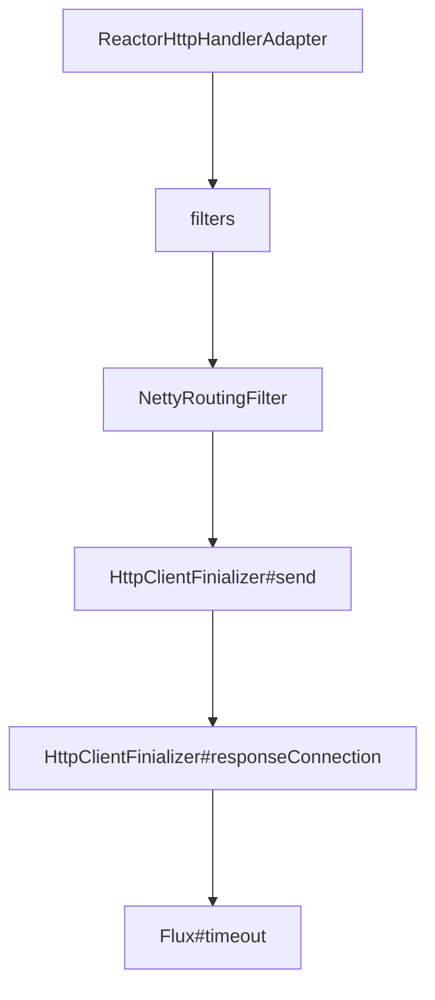

## Trace Propagation Path

1. TraceContext is created on `ReactorHttpHandlerAdapter`
2. TraceContext is held in thread local for following interceptors to use
3. methods of `HttpClientFinializer` is called in `NettyRoutingFilter`
4. Trace span for `HttpClientFinializer` is created in `HttpClientFinializer#send` and is released in `HttpClientFinializer#responseConnection`