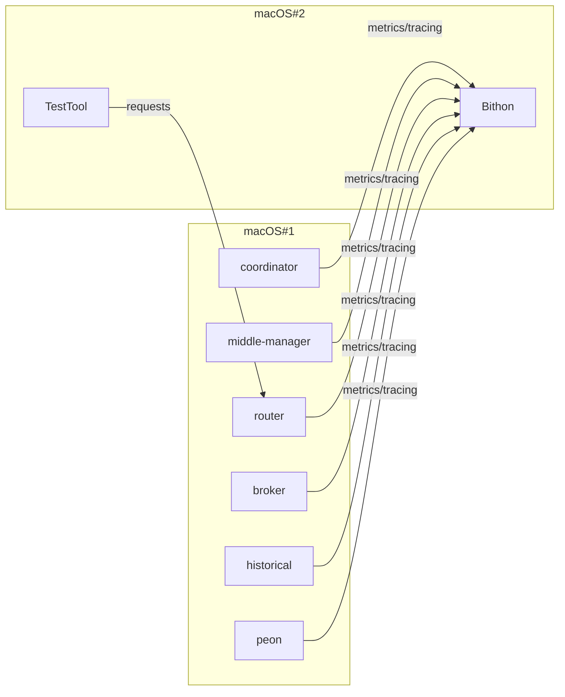

#  Benchmark

This article describes the performance loss caused by the java agent that is attached to target applications.

The performance loss comes from several aspects.
1. The time spent on code injection to target methods of some class when a specific class is loaded into class loader
2. The injected code that is around some specific methods of some classes to finish the metrics and tracing data collection
3. The background work that the agent is doing for sending the collected data to remote servers

## Evaluation Method

The 1st slows the startup of an application. How many seconds that it may take depends on how many classes will be loaded into the class loader during the startup phase and how many plugins will take effect. Obviously, the more classes an application will load, the more time it needs to start up the application.

To evaluate such performance loss, we just pick up some application without any special purposes and then compare the startup time before and after the java is attached.

For the 2nd the 3rd performance issues, it's not easy to separate them for evaluation respectively. So let's consider them together.

Since the injected code are mainly on HTTP request call paths, we can evaluate the overhead by benchmark the QPS of a HTTP interface before and after the agent is attached to see how it impact the QPS of an interface. Also, we will monitor the CPU and memory usage during this phase to compare the overhead.

## Target Application

We select target applications without any special purposes. The test can be done on any applications.

Here let's pick Apache Druid as the target application. Apache Druid provides multiple different kinds of processes, we can see how the agent slows the startup for different processes.

## Evaluation Steps

### Startup overhead

1. start up the nano configuration of Apache Druid cluster(coordinator, overlord, middle-manager, historical, router, broker), check their logs to see when the applications start to specific point
2. attache the java agent to the target applications by the default configuration, start up the cluster again to see how long the processes take to finish the startup

### QPS loss

#### Deployment



#### Hardware Configurations

- macOS#1
  - MacBookPro 2019, 2.6 GHz 6-Core Intel Core i7, 16 GB 2667 MHz DDR4

- macOS#2
  - MacBookPro 2018, 2.6 GHz 6-Core Intel Core i7, 16 GB 2400 MHz DDR4

#### Steps
1. start upt the nano configuration of Apache Druid with the java agent that only enable the JVM plugin to collect Java application's basic metrics such CPU usage and memory usage
   1. Issue query request on the wikipedia data source with different intervals from a client repeatedly to get the QPS

2. start up the nano configuration of Apache Druid with java agent's default configuration which by default will load all plugins, do the test as described step 1 again to check the QPS

3. start up the nano configuration of Apache Druid with java agent's default configuration which by default will load all plugins, set the sampling rate of tracing to 100%, do the test as described as step 1 again to evaluate the QPS

## Startup Test Result

Once the application start, grep the 'Started' keyword to see the how long the application takes to start up. Following tables illustrates the result.

| Process              |  No Agent Attached(ms)  |  Bithon Agent Attached  |  Skywalking 8.8.0 Agent Attached  |
|----------------------|:-----------------------:|:-----------------------:|:---------------------------------:|
| Broker               |          11900          |          20639          |               45161               |
 | coordinator-overlord |          11561          |          19463          |               43820               |
 | historical           |          11145          |          19109          |               43046               |
 | middleManager        |          10521          |          18206          |               42588               |
| router               |          10255          |          17888          |               41751               |

## Performance Overhead


### Test Code

```java
Timer timer = Timer.builder("timer")
                   .publishPercentiles(0.95, 0.99)
                   .publishPercentileHistogram()
                   .serviceLevelObjectives(Duration.ofMillis(100))
                   .minimumExpectedValue(Duration.ofMillis(1))
                   .maximumExpectedValue(Duration.ofSeconds(10))
                   .register(registry);

while (counter++ < 1000) {
    query.query = String.format("SELECT * FROM wikipedia WHERE __time > MILLIS_TO_TIMESTAMP(%d) LIMIT 10", timestamp++);
    
    long s = System.nanoTime();
    URI uri = restTemplate.postForLocation("http://192.168.2.50:8888/druid/v2/sql", query);
    long e = System.nanoTime();
    
    long t = e - s;
    min = Math.min(min, t);
    timer.record(t, TimeUnit.NANOSECONDS);
}
```

#### Execution Flow
The SQL is sent to Apache Druid's router process, and then will be forwarded to broker process. 
And the broker process will turn the SQL query into a Druid's native JSON query which is executed on historical process.

The execution flow is demonstrated as follows, which is illustrated on the trace map of a trace from Bithon.


### Baseline data

Following table shows the test result of target application without the agent attached. It can be seen as the baseline.

| Min(ms)   | Max(ms)     | Avg(ms)   | P95(ms)   | P99(ms)    | Total(ms)    | QPS       |
|-----------|-------------|-----------|-----------|------------|--------------|-----------|
| 11.521551 | 1570.164795 | 18.105044 | 25.690112 | 35.127296  | 18105.044390 | 55.233226 |
| 10.037163 | 271.962058  | 18.035038 | 31.981568 | 234.356736 | 18035.038252 | 55.447623 |
| 9.527078  | 121.700399  | 12.519399 | 14.680064 | 20.447232  | 12519.398663 | 79.876041 |
| 9.072599  | 188.775564  | 12.434603 | 14.680064 | 19.398656  | 12434.602910 | 80.420743 |
| 9.415687  | 231.724722  | 12.871435 | 16.252928 | 20.447232  | 12871.434719 | 77.691417 |
| 8.826839  | 194.161764  | 12.204509 | 15.204352 | 20.447232  | 12204.508674 | 81.936932 |
| 8.427772  | 114.907242  | 11.866819 | 14.680064 | 17.301504  | 11866.818740 | 84.268583 |
| 9.140316  | 117.138842  | 12.143304 | 14.680064 | 17.301504  | 12143.304167 | 82.349910 |
| 9.234472  | 170.801116  | 13.098089 | 18.350080 | 23.592960  | 13098.089207 | 76.347014 |

The first row reflects how the target application perform when they receive first batch of requests.
This means the application run some extra code path to initialize the system such as web container.
So it does not reflect the best performance of the system, and should be ignored.

### 0% Sample Rate

In this mode, only metrics are collected. Distributed tracing data are not collected.

| Min(ms)   | Max(ms)    | Avg(ms)   | P95(ms)   | P99(ms)   | Total(ms)    | QPS       |
|-----------|------------|-----------|-----------|-----------|--------------|-----------|
| 10.139944 | 135.948603 | 13.292974 | 15.728640 | 24.641536 | 13292.974002 | 75.227711 |
| 9.276753  | 130.915040 | 12.805871 | 17.301504 | 21.495808 | 12805.871101 | 78.089182 |
| 9.522447  | 168.259115 | 12.837245 | 15.728640 | 18.350080 | 12837.244605 | 77.898337 |
| 9.390411  | 137.041908 | 12.861528 | 17.301504 | 23.592960 | 12861.527560 | 77.751262 |
| 8.842841  | 188.844990 | 12.744795 | 16.252928 | 21.495808 | 12744.795291 | 78.463402 |

### 100% Sample Rate

The agent is configured to collect all tracing data for all requests by setting this parameter `-Dbithon.tracing.sampleRate=100` whose value by default is 0.

  | Min(ms)   | Max(ms)    | Avg(ms)   | P95(ms)   | P99(ms)   | Total(ms)    | QPS       |
|-----------|------------|-----------|-----------|-----------|--------------|-----------|
 | 9.822966  | 221        | 14.467531 | 19.398656 | 30.932992 | 14467.531074 | 69.120294 |
 | 9.666261  | 184.239250 | 13.756679 | 17.301504 | 22.544384 | 13756.678553 | 72.691965 |
 | 10.593221 | 211.051527 | 14.347612 | 17.301504 | 21.495808 | 14347.612100 | 69.698009 |
 | 9.953338  | 200.668676 | 13.894033 | 17.301504 | 20.447232 | 13894.033482 | 71.973340 |
 | 9.988679  | 146.855961 | 14.310916 | 18.350080 | 23.592960 | 14310.916409 | 69.876727 |
 | 8.848288  | 128.196301 | 12.417677 | 15.728640 | 20.447232 | 12417.676915 | 80.530361 |

If we look at the P99 column, we can see that

### CPU Consumption

#### 0% Sample Rate
Router - 
Broker - 
Historical - 

#### 100% Sample Rate
Router

Broker

Historical

Trace 