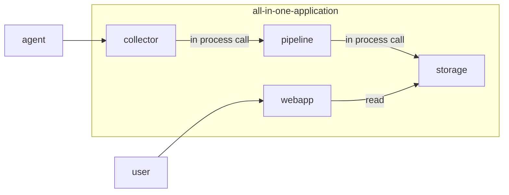
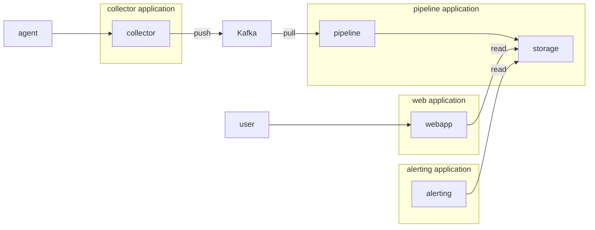
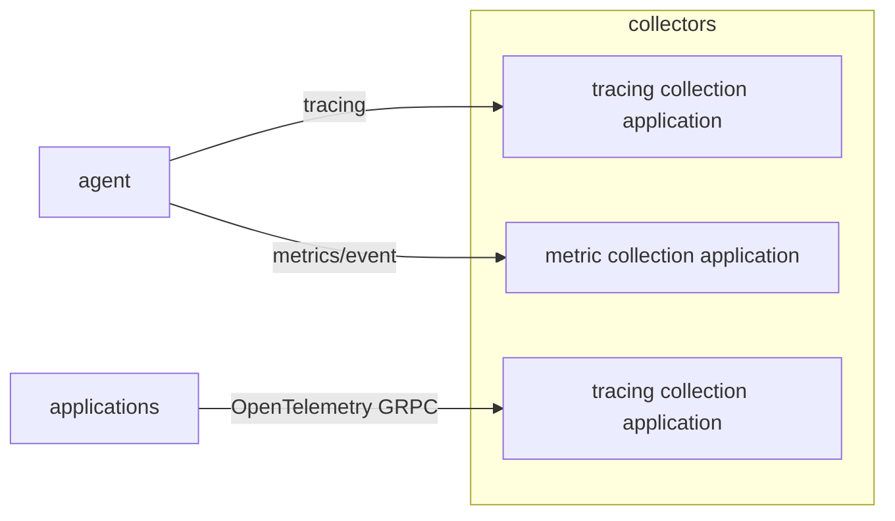
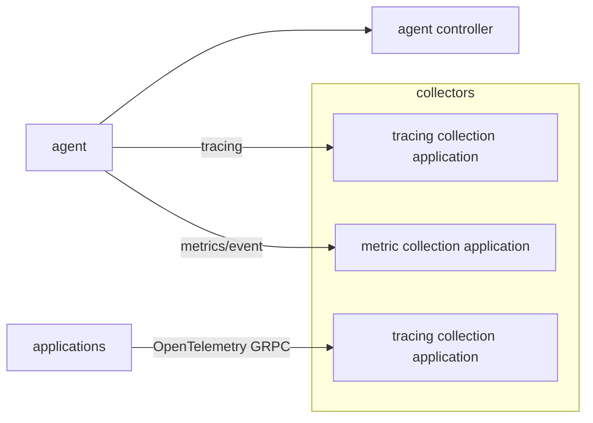

# Introduction

This file illustrates the flexible deployments of Bithon to adapt to a small data scale to a very huge data scale.

# All in one deployment

This deployment deploys all the components in one application.
It's the simplest deployment and is handy when developing this project.
The [application-all-in-one.yml](../../server/server-starter/src/main/resources/application-all-in-one.yml) is used demonstrates how we can achieve it.

# Separated deployment
In a huge data scale, independent deployments of each component make it much easier to scale out or upgrade.
For example, when the number of client applications goes up quickly, we can scale out the collector module.
When we deploy the alerting module, any changes of collector, pipeline module have no impact on the alerting module.

In this case, a Kafka is recommended to decouple collector and pipeline modules.
The following chart illustrates the deployments

For the `collector` module, the [application-pipeline-to-kafka.yml](../../server/server-starter/src/main/resources/application-pipeline-to-kafka.yml) is used
to demonstrate how the collector pushes the data it receives to Kafka.

For the `pipeline` module, the [application-pipeline-from-kafka](../../server/server-starter/src/main/resources/application-pipeline-from-kafka.yml) is used
to demonstrate how the pipeline module consumes message from Kafka and then pushes the data into underlying storage.

For the `alerting` module, it's recommended to deploy it independently.
The [application-alerting.yml](../../server/server-starter/src/main/resources/application-alerting.yml) is for you reference for the dedicated deployment.

For the `webapp` module,
[application-webapp.yml](../../server/server-starter/src/main/resources/application-webapp.yml) is for your reference.

# Separated collector
In above sample configuration, the `collector` module enables all its supported collection method in one module.
You can even separate the collector for the sake of traffic segregation.

For example, we can separate the metrics/events from the tracing collection.
Or we can separate the tracing collection from HTTP.

# Separated agent controller

The agent controller can be deployed with collector module or deployed independently.
This is useful when the agent controller module can be changed without any impact on data collection.

If so, for the `collector` module, the `bithon.agent-controller.enabled` property should be declared as `false`,
and the agent controller application should be deployed with proper definition
as declared in [application-controller.yml](../../server/server-starter/src/main/resources/application-controller.yml).

