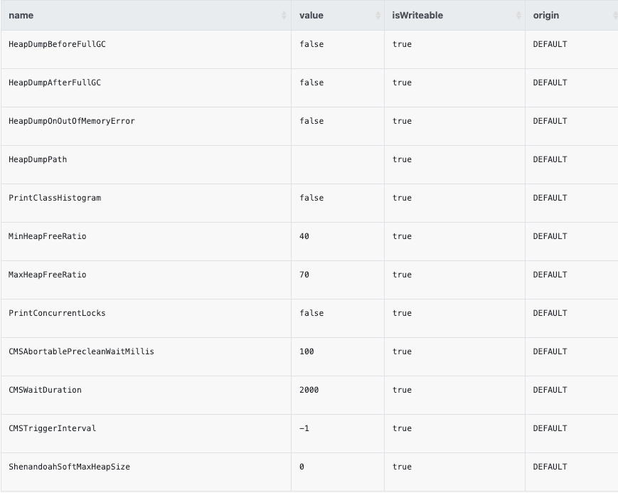

Bithon provides SQL-based commands to debug/profile an application in interactive way.

All commands are sent to a specific application instance immediately to perform the query or command.
These commands are not persistent in the backend of Bithon, this means once the application instance restarts,
previous commands went away.

# Rationale

Bithon's agent set up a bidirectional TCP channel to its collector. 
Each instance of collectors can get information from this channel or update information through this channel.

Over this channel, all messages are in protobuf or SMILE encoded JSON text. Which one is used is dependent on the implementations.

In practice, the Bithon collector is usually deployed after a network load balancer, this means each collector has to communicate only parts of the target applications.
To communicate with the right target application instance, we need a SERVICE DISCOVERY mechanism to help us find the right collector that is connecting to the target application instance.
Currently, only Alibaba Nacos is supported.

You can check the [Nacos Configuration](../configuration/server/configuration-nacos.md)

Under such a mode, each collector registers itself on Alibaba Nacos. When we want to send commands to a specific application instance,
Bithon will first talk with Alibaba Nacos to get all collector instances, and then broadcast these commands to all collector instances.
Because the commands contain the information of target application,
only one of the collectors has connection to the target application.
When such a collector receives the command, it gets the right connection to the target application instance from its connections, and then sends commands on such connection.

But if the collector is not deployed behind a network load balancer, that's to say it's deployed as a single instance, there's no need of deployment of Alibaba Nacos,
because this collector has all connections to the target applications.

# Get all tables

Bithon allows users to get insight into the application by using standard SQL grammar. All information that we can access is organized in TABLE.
You can even use SQL to get all supported tables.

```sql
SELECT * FROM INFORMATION_SCHEMA.tables
```

An example output is shown as follows. 

| TABLE_CATALOG | TABLE_SCHEMA | TABLE_NAME    | TABLE_TYPE | IS_JOINABLE | IS_BROADCAST |
|---------------|--------------|---------------|------------|-------------|--------------|  
| agent         | agent        | configuration | TABLE      | NO          | NO           |

It tells that there's a table `configuration` under `agent` database. So we can use SQL like `SELECT * FROM agent.configuration` for further SELECT or UPDATE operation.

# Diagnosis User manual

The following table shows all the built-in tables that Bithon supports now.

| Table Name                                             | SELECT  | UPDATE  | Description                                                                     |
|--------------------------------------------------------|---------|---------|---------------------------------------------------------------------------------|
| [agent.instance](#agentinstance)                       | &check; |         | The connected target applications to Bithon collector                           |
| [agent.configuration](#agentconfiguration)             | &check; |         | Effective configurations of agent                                               |
| [agent.instrumented_method](#agentinstrumented_method) | &check; |         | All intercepted methods of target application for observability and diagnosis   |
| [agent.loaded_class](#agentloaded_class)               | &check; |         | All classes that are loaded into the target application.                        |
| [agent.logger](#agentlogger)                           | &check; | &check; | Logging levels of all loggers of target application                             |
| [agent.thread](#agentthread)                           | &check; |         | Snapshot of threads  running in the target application when the SQL is executed |
| [agent.vm_option](#agentvm_option)                     | &check; |         | Diagnostic VM options of target Java application.                               |
| [agent.assembly](#agentassembly)                       | &check; |         | Disassembly a given class                                                       |


## agent.instance

This is the most common used SQL that it shows all the application instances that are connecting to Bithon.
We will use the `instance` column that it outputs for further operations.

### SQL

```sql
SELECT * FROM agent.instance
```

### Output example

| appName        | instance            | endpoint        | collector         | agentVersion                                                                        | startAt                 |
|----------------|---------------------|-----------------|-------------------|-------------------------------------------------------------------------------------|-------------------------|
| bithon-web-dev | 192.168.50.151:9897 | 127.0.0.1:55000 | 192.169.50.1:9899 | 1.0-SNAPSHOT@ab9fca6d44b6f19fc751b383a3ebe3aa44cbddb1@2023-04-08T13:38:16.532+08:00 | 2023-04-17T09:29:14.629 |


### Field Explanation

| Field        | Explanation                                                                                                         |
|--------------|---------------------------------------------------------------------------------------------------------------------|
| appName      | The application name of an target application, also the value of `-Dbithon.application.name` JVM parameter.         |
| instance     | The instance id of target application.                                                                              |
| endpoint     | The real endpoint of the target application that connects to the Bithon collector                                   |
| collector    | The endpoint of Bithon collector that the agent is connecting to                                                    |
| agentVersion | The version of the agent that the target application loads. It's in the format as: <VERSION>@<CommitId>@<Timestamp> |
| startAt      | The timestamp when the target application starts                                                                    |

### NOTE
The diagnosis SQL supports standard SQL grammar. We can also use more filters or aggregators to get more information. For example

```sql
# Count the instance number per appName
SELECT appName, count(1) FROM agent.instance GROUP BY appName ORDER BY appName
 
 # Get all instances whose application name starts with 'bithon-'
SELECT * FROM agent.instance WHERE appName like 'bithon-%' 
```

## agent.configuration

Following SQL shows how can I get the effective configuration for the agent running in given application instance.

### SQL

```sql
SELECT * FROM agent.configuration WHERE instance = '192.168.50.151:9897'
```

### Output example

This returned configuration is displayed in YAML format. For example:

```yaml
---
application:
  name: "bithon-kafka-to-css"
  env: "live"
controller:
  servers: "10.180.128.197:9899"
  client: "org.bithon.agent.dispatcher.brpc.BrpcAgentControllerFactory"
dispatchers:
  metric:
    client:
      factory: "org.bithon.agent.dispatcher.brpc.BrpcChannelFactory"
      maxLifeTime: 300000
    servers: "10.180.128.197:9898"
  tracing:
    client:
      factory: "org.bithon.agent.dispatcher.brpc.BrpcChannelFactory"
      maxLifeTime: 300000
    servers: "10.180.128.197:9895"
    batchSize: 2000
    flushTime: 3000
    queueSize: 8192
  event:
    client:
      factory: "org.bithon.agent.dispatcher.brpc.BrpcChannelFactory"
      maxLifeTime: 300000
    servers: "10.180.128.197:9896"
    batchSize: 500
    flushTime: 5000
```

## agent.instrumented_method

During agent plugin development and agent debugging, we need to know whether our interceptors have been successfully installed.
To do this, we can use the following SQL to check.

### SQL

```sql
SELECT * FROM agent.instrumented_method WHERE instance = '192.168.50.151:9897'
```

### Output fields explanation

| Field       | Explanation                                                                          |
|-------------|--------------------------------------------------------------------------------------|
| interceptor | The class name of interceptors that intercept the target method.                     |
| clazzLoader | The class loader id that loads the target class.                                     |
| hitCount    | How many times that the interceptor has been called.                                 |
| clazzName   | The class of the target method.                                                      |
| isStatic    | Whether the target method is a static method.                                        |
| returnType  | The return type of target method.                                                    |
| methodName  | The name of intercepted method. `<ctor>` represents constructor of the target class. |
| parameters  | The parameters of intercepted method.                                                |

## agent.loaded_class

### SQL

```sql
SELECT * FROM agent.loaded_class WHERE instance = '192.168.50.151:9897'
```
### Output fields explanation

| Field        | Explanation                                                 |
|--------------|-------------------------------------------------------------|
| name         | The name of loaded class.                                   |
| classLoader  | The class name of class loader that loads the target class. |
| isSynthetic  | 1 if the target class is a synthetic class.                 |
| isInterface  | 1 if the target class is an interface.                      |
| isAnnotation | 1 if the target class is an annotation.                     |
| isEnum       | 1 if the target class is an enum class.                     |

## agent.logger

> NOTE: This only works for application based on SpringBoot 1.5 and above.
>

### SQL

```sql
SELECT * FROM agent.logger WHERE instance = '192.168.50.151:9897'
```

### Output field Explanation

| Field          | Explanation                                                                                                             |
|----------------|-------------------------------------------------------------------------------------------------------------------------|
| name           | The name of a logger.                                                                                                   |
| level          | The configured logging level of corresponding logger. <br/> Can be one of: OFF, TRACE, DEBUG, INFO, WARN, ERROR, FATAL. |
| effectiveLevel | The effective logging level of a logger.                                                                                |

## Set logger level

> NOTE: This only works for application based on SpringBoot 1.5 and above.
>

We can also change the configured logging level during application running by using `UPDATE` statement.

### SQL

```sql
UPDATE agent.logger SET level = 'DEBUG' where instance = '192.168.50.151:9897' AND name = 'org.bithon' AND _token = '525'
```

> NOTE:
> 1. The SQL must provide `instance` and `name` filter in the `WHERE` clause.
> 2. Only `level` can be UPDATED
> 3. For the `_token'
>   1. If the server is deployed with the OAuth2 enabled, the token is not needed. The user associated with the login user will be used for authorization internally.
>   2. If the server is not enabled OAuth2, it's needed. And it's configured on the server side per-application basis.
>   3. See [Permission Control](../configuration/server/configuration-controller.md) section to know more about authorization configuration.


## agent.thread

### SQL

```sql
SELECT * FROM agent.thread WHERE instance = '<THE TARGET INSTANCE>'
```

### Field Explanation

| Field         | Explanation                                                                                                                                                                                                                                                                   |
|---------------|-------------------------------------------------------------------------------------------------------------------------------------------------------------------------------------------------------------------------------------------------------------------------------|
| threadId      | Id of a running thread                                                                                                                                                                                                                                                        |
| name          | Name of a running thread                                                                                                                                                                                                                                                      |
| daemon        | Whether the thread is running as a daemon thread                                                                                                                                                                                                                              |
| priority      | The priority of a thread                                                                                                                                                                                                                                                      |
| state         | State of a running thread                                                                                                                                                                                                                                                     |
| cpuTime       | The total CPU time in nanoseconds for a thread if CPU time measurement is enabled; -1 otherwise.<br/>Whether the CPU time measurement is enabled is determined by the JVM implementation. See `ManagementFactory.getThreadMXBean().isThreadCpuTimeSupported()` for more info. |
| userTime      | The user-level CPU time for a thread if CPU time measurement is enabled; -1 otherwise.                                                                                                                                                                                        |
| blockedTime   | The approximate accumulated elapsed time in milliseconds that a thread entered the BLOCKED state; -1 if thread contention monitoring is disabled.                                                                                                                             |
| blockedCount  | The total number of times that the thread entered the BLOCKED state.                                                                                                                                                                                                          |
| waitedTime    | The approximate accumulated elapsed time in milliseconds that a thread has been in the WAITING or TIMED_WAITING state; -1 if thread contention monitoring is disabled.                                                                                                        |
| waitedCount   | The total number of times that the thread was in the WAITING or TIMED_WAITING state.                                                                                                                                                                                          |
| lockName      | The string representation of the object on which the thread is blocked if any; null otherwise.                                                                                                                                                                                |
| lockOwnerId   | The thread ID of the owner thread of the object this thread is blocked on; -1 if this thread is not blocked or if the object is not owned by any thread.                                                                                                                      |
| lockOwnerName | The name of the thread that owns the object this thread is blocked on; null if this thread is not blocked or if the object is not owned by any thread.                                                                                                                        |
| inNative      | 1 if the thread is executing native code; 0 otherwise.                                                                                                                                                                                                                        |
| suspended     | 1 if the thread is suspended; 0 otherwise.                                                                                                                                                                                                                                    |
| stack         | The stack trace of one thread.                                                                                                                                                                                                                                                |

## agent.vm_option

This table reflects all the available diagnostic [VM options](https://docs.oracle.com/javase/8/docs/jre/api/management/extension/com/sun/management/VMOption.html) of target Java application. 

```sql
SELECT * FROM agent.vm_option WHERE instance = '<THE TARGET INSTANCE>'
```
### Field Explanation

| Field      | Explanation                                                                                                        |
|------------|--------------------------------------------------------------------------------------------------------------------|
| name       | The name of VM option                                                                                              |
| value      | Returns the value of this VM option at the time when this VMOption was created. The value could have been changed. |
| isWritable | Tests if this VM option is writeable. If this VM option is writeable, it can be set by the `UPDATE` SQL.           |
| origin     | The origin of the value of this VM option. That is, where the value of this VM option came from.                   |


### Example



## agent.assembly

This table reflects the disassembled code of a given class.

```sql
SELECT * FROM agent.assembly WHERE instance = '<THE TARGET INSTANCE>' AND class = 'org.apache.http.impl.client.CloseableHttpClient'
```

### Example


