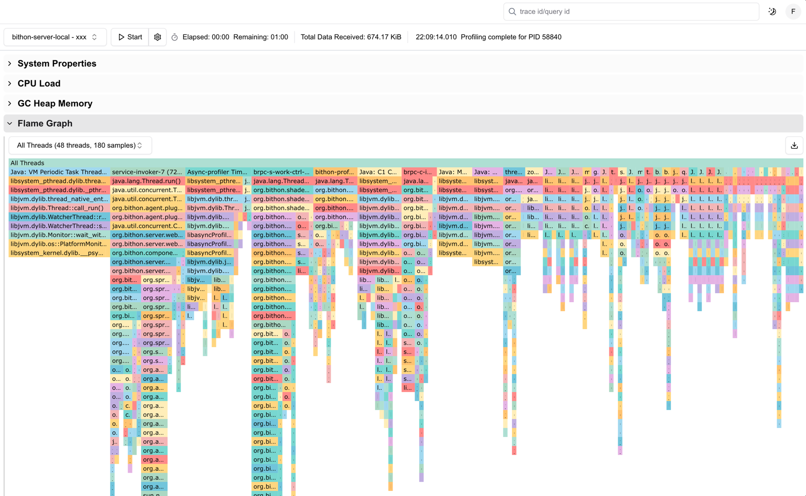

This document describe the continuous profiling feature.

# Illustration
The below picture illustrates the use of continuous profiling.

# Steps to use
1. Select a application to profile
2. Click the 'Start' button to start the profiling
   > By default, the profiling duration is 180 seconds, and the interval to collect profiling data is 3 seconds
3. Once the profiling is started, the Web UI will continuously receive data from target application and shows CPU/Memory usage as well as stack traces in flamegraph. 
