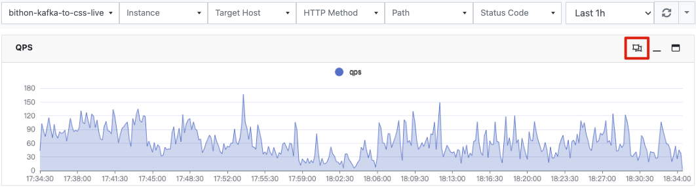
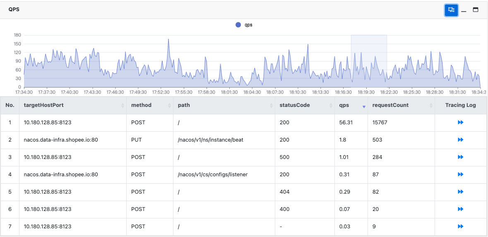
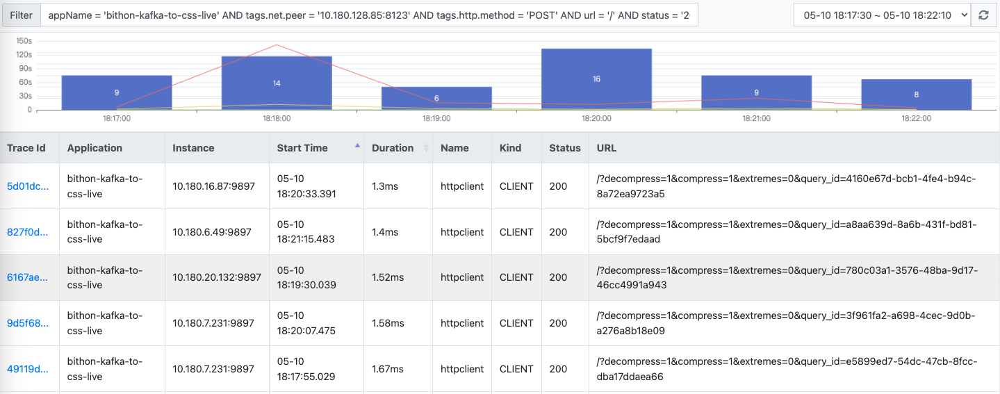

# Description

The http-outgoing metrics provides a set of metrics for HTTP requests issued from a given application
if this application uses the following HTTP client library.

- JDK HTTP Client
- Apache HTTP Client
- okhttp3
- Jetty HTTP Client
- Netty 3 HTTP Client
- WebFlux Web Client

# Metrics

The following table describes all metrics under this metric set.

| Type      | Field            | Description                                                                                                      |
|-----------|------------------|------------------------------------------------------------------------------------------------------------------|
| Dimension | appName          | The name of application that the metric is from. Equivalent to the value of `-Dbithon.application.name` property |
| Dimension | instanceName     | The ip and port of the target application.                                                                       |
| Dimension | targetHostPort   | The remote HTTP server that the http request is sent to                                                          |
| Dimension | method           | The HTTP method of the outgoing HTTP request.                                                                    |
| Dimension | path             | The URL of the outgoing HTTP request.                                                                            |
| Dimension | statusCode       | The received HTTP status of this HTTP request.                                                                   |
| Metric    | responseTime     | The accumulated response time of this HTTP request in nanosecond.                                                |
| Metric    | minResponseTime  | The minimum response time of HTTP requests on the same server and path in a period.                              |
| Metric    | maxResponseTime  | The max response time of HTTP requests on the same server and path in a period.                                  |
| Metric    | count4xx         | The count of HTTP requests that return HTTP status code between 400 (inclusive) and 499 (inclusive) in a period. |
| Metric    | count5xx         | The count of HTTP requests that return HTTP status code greater than or equal 500 in a period.                   |
| Metric    | countException   | The count of HTTP requests that raise exception during HTTP request in a period.                                 |
| Metric    | requestCount     | The count of HTTP requests that are sent of the same server and path in a period.                                |
| Metric    | requestBytes     | The total bytes of HTTP request body.                                                                            |
| Metric    | responseBytes    | The total bytes of received HTTP response body.                                                                  |
| Metric    | avgResponseTime  | The average response time of HTTP requests that are sent to the same server and path in a period.                |
| Metric    | qps              | The QPS of HTTP requests in a given time range.                                                                  |
| Metric    | requestByteRate  | The byte rate of HTTP request body in given time range.                                                          |
| Metric    | responseByteRate | The byte rate of HTTP response body in a given time range.                                                       |

> Note:
> 
> For the `path`, its value is normalized and all query parameters are striped. For example, `/api/order/show/1` will be automatically normalized as `/api/order/show/*` to save space.

# Correlation with Distributed Tracing

## Tracing Context Propagation

If one outgoing HTTP request is under a tracing context, 
then the tracing context will be automatically propagated to the upstream HTTP server by following the [W3C trace context standard](https://www.w3.org/TR/trace-context/#trace-id").

In such case,
an HTTP header `traceparent` is automatically added by Bithon to the outgoing HTTP request
so that the upstream server can have a chance to record tracing logs on such request.

Whether the remote server will trace this request depends on if it implements the W3C tracing context standard.

## Search distributed tracing logs from dashboard

In Bithon, the metrics and tracing logs are recorded separately.
The metrics or dashboards provide an intuitive way
to find any anomaly while the tracing logs provide us more detail information
 of a specific request/transaction.

Bithon's dashboard integrates these both two system well so that we can easily find tracing logs from dashboards.

For HTTP outgoing requests, we can search any related tracing logs from the dashboard of http-outgoing metrics easily.
The following pictures illustrate this capability.

- Step 1. Open the HTTP outgoing dashboard, and click the icon on the upper right of a dashboard as shown below
     

- Step 2. Select a time range on the dashboard by using your mouse, and then a table will be loaded to show the metrics in the given time range.
    

- Step 3. Click the arrow in a row in the loaded table, a new page will be open to show you the related tracing logs that are related to dimensions/metrics in the data row you select.
    

> **NOTE**:
> 
> On the newly open tracing log page, the number of tracing logs might be less than the count of HTTP requests. 
> This is because not all outgoing HTTP requests have tracing context, for example, some HTTP requests issued from a background task.
> 
> For more information of tracing context initialization, see the [doc](../../tracing/README.md) here.