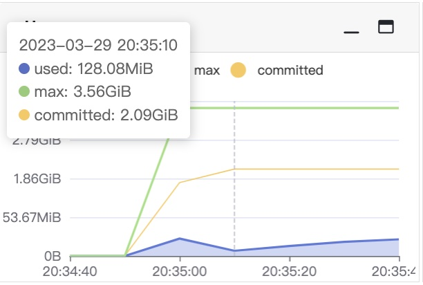
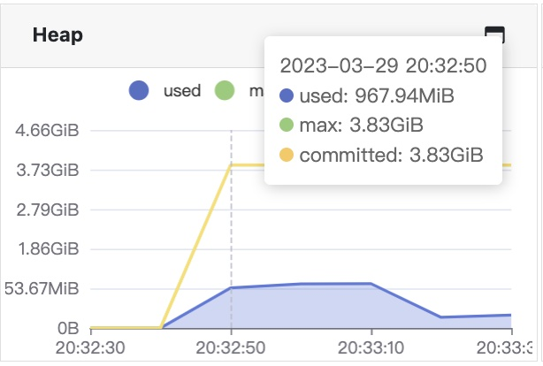
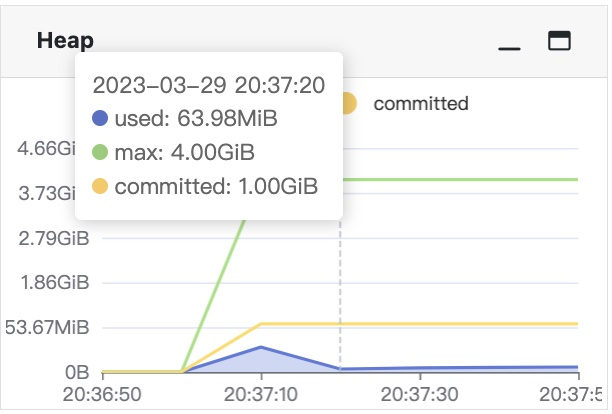

## Memory Heap Size

### Understanding the `max` heap size

The `max` metric shows the max heap that the application can use. 
It's the value returned by `ManagementFactory.getMemoryMXBean.getHeapMemoryUsage().getMax()`.

Typically, if `-Xmx` parameter is set to a Java application, the `max` metric is reflects that value.
But different JREs that the application runs on may behave a little differently.

For example, for `-Xms1g -Xmx4g` configuration on JRE 8, the `max` may first show a value of 3.56GiB, which is less than 4GiB that is specified by `-Xmx4g`.
But never mind, the JRE can utilize the full 4GiB memory if necessary.

However, if both `-Xms` and `-Xmx` are set to be the same, such as `-Xmx4g -Xmx4g`, we might see the `max` metric show a value of 3.83GiB which is a little larger than previous example.

If the target application runs on JRE 17, there's a little difference. We can see that once the application starts, the `max` is exactly 4GiB which is the value that we set by `-Xmx4g` parameter.

So, generally speaking, the `max` heap size reflects the upper limit at one point that one application can use. There might be a little gap between the value and that of configured `-Xmx` value.
