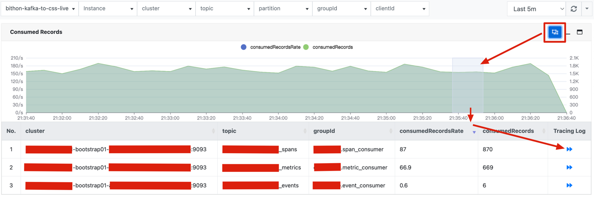
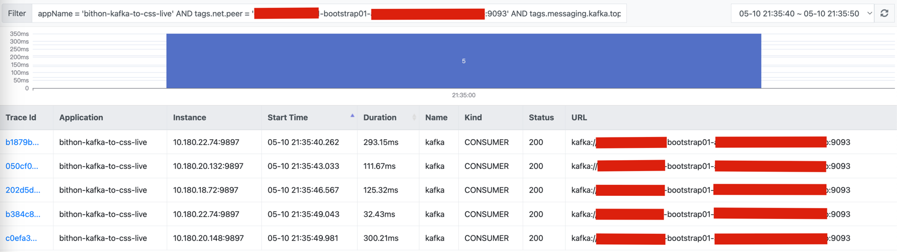

# Description

The Kafka consumer metrics provides a set of metrics for Kafka Consumers running in a given application.

# Metrics

The following table describes all metrics under this metric set.

| Type      | Field               | Description                                                                                                           |
|-----------|---------------------|-----------------------------------------------------------------------------------------------------------------------|
| Dimension | appName             | The name of application that the metric is from. Equivalent to the value of `-Dbithon.application.name` property      |
| Dimension | instanceName        | The ip and port of the target application.                                                                            |
| Dimension | cluster             | The cluster address of Kafka servers.                                                                                 |
| Dimension | topic               | The topic that the Kafka consumer is consuming from.                                                                  |
| Dimension | partition           | The partition that the Kafka consumer is assigned to.                                                                 |
| Dimension | groupId             | The group that the Kafka consumer belongs to. Equivalent to the `group.id` configuration of the Kafka consumer.       |
| Metric    | clientId            | The client id configuration of the Kafka consumer, equivalent to the `client.id` configuration of the Kafka consumer. |
| Metric    | consumedBytes       | How many bytes the consumer has taken from the server in a period.                                                    |
| Metric    | consumedRecords     | How many records the consumer has taken from the server in a period.                                                  |
| Metric    | consumedBytesRate   | The byte rate that the consumer consumes in a period.                                                                 |
| Metric    | consumedRecordsRate | The record rate that the consumer consumes in a period.                                                               |

# Correlation with Distributed Tracing

## Search distributed tracing logs from dashboard

In contrast to metrics which work for pure Kafka Consumer clients, Bithon will only set up tracing context for Kafka consumer
if the target application uses Spring Kafka Listener mechanism to consume messages.

After both metrics and tracing logs are collected, we can easily search tracing logs from dashboards.

On each Kafka consumer dashboard, we can select a time range on the dashboard,
and then select a row that we care about
to search tracing logs.

