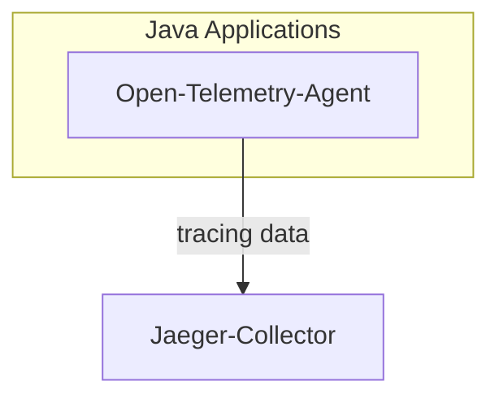
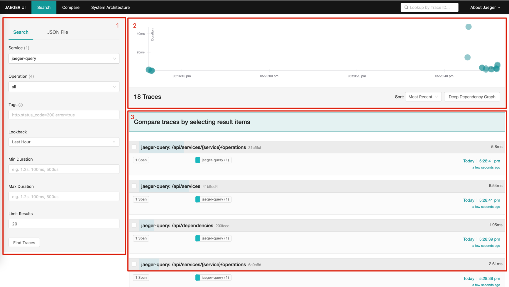

# Different between Jaeger and Bithon

To be frank, I don't like to such comparison since we're not target to replace it.
I have given a picture of Bithon and the problem domain of in the [white paper](../../white-paper.md).

But since there is such a question, I will give a quick description here.

> Declaration
> 
> I don't know Jaeger very well, I have never studied its architecture since it's not famous and widely used in China. 
> But it seems like it has more users outside China.
> What I know about it is based on my experience of installing it via Docker and using on its Web UI. 
The statements below may be fair, but I'm trying to be fair.

## Jaeger Architecture

> NOTE: The image above is from: https://www.jaegertracing.io/img/architecture-v1.png

This is the common architecture that most of the APM systems choose. 

But what's different that Jaeger differ from Bithon or other tools like PinPoint or Skywalking is that it deploys an extra Process named as `jaeger-agent` on client application's host to collect tracing data.
Usually we don't it like this because it introduces some complexity at the client application side.

2nd, the jaeger-client uses UDP as transport protocol to transfer tracing data. However, Bithon, as well as PinPoint, Skywalking are using TCP to transfer data.
It's hard to say which one is better. Because UDP usually have better performance if the data volume is very large, saying up to GiB level. But of course TCP is more reliable.

At the storage layer, it can be one of Cassandra, Elasticsearch or Kafka.

### Jaeger with OpenTelemetry

Jaeger also supports collecting tracing data from opentelemetry agent.

## Jaeger UI

Jaeger's UI is simple. It provides a page to search trace.

The page is divided into 3 sections:
1. Search Panel to fill various search conditions
2. Heat map to show the response time of traces that match the search conditions
3. Search result

When clicking any trace in the result panel, it redirect us to a detail view page to check the detail of that specific tracing.

> NOTE: The image above is from: https://www.jaegertracing.io/img/frontend-ui/embed-trace-view-with-back-button.png
 
The trace can also be showed as a graph as below:

> NOTE: The image above is from: https://user-images.githubusercontent.com/12240548/50177838-480b5c00-0303-11e9-9281-8e38059a0745.jpg

## Summary

| Features                                             | Jaeger                        | Bithon                                      |
|------------------------------------------------------|-------------------------------|---------------------------------------------|
| Supported Clients                                    | Java and some other languages | Java                                        |
| OpenTelemetry Support                                | Support OpenTelemetry agent   | Support OpenTelemetry tracing specification |
| [UI] Tree style tracing data                         | &check;                       | &cross;                                     |
| [UI] Heatmap                                         | &check;                       | &cross;                                     |
| Search by tags                                       | &check;                       | &cross;                                     |
| Support to search tracing data by trace id           | &check;                       | &check;                                     |
| Support to search tracing data by user's business id | &cross;                       | &check;                                     |
| [UI]Topo of a specific trace                         | &cross;                       | &check;                                     |
| Metrics                                              | &cross;                       | &check; More than 200+ metrics              |
| Apache Druid as client application                   | &cross;                       | &check; Both SQL and native query           |

### Is there any plan for Bithon to implement those not supported features ?

It depends on our short and long term goal. 

For example, current we're aiming to integrate tracing and metrics better as we have done before in our production. So features like searching by tag is a necessary feature that is in that domain, we will do it.
But like features supporting more clients, are not our goal, we will not do it in a visible period.

As for UI improvement such as heatmap, it will only be done when we have enough bandwidth.