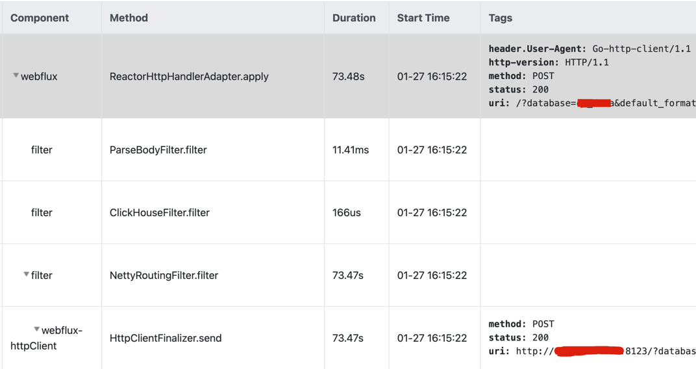

# How does the agent work

## Abstract

This article explains the rationale of the agent-based technology used in Bithon to collect metrics and tracing data.
After reading the article, hope you also generally understand the performance cost that it brings about so that when looking at the [benchmark](../../benchmark/agent/agent-benchmark.md),
we're in the same language.

The agent provided by Bithon is mainly collecting data of target application, including metrics and tracing. 
Although it has a vision to integrate the logging together with metrics and tracing, it does not collect logs from the target application because there are already many sophisticated ways to do that out of the target applications.

## Metrics

### Rationale

Bithon collects a bunch of metrics, including JVM, incoming HTTP requests and outgoing HTTP requests etc.
For all metrics, they're temporarily aggregated at the agent side and are sent to remote servers in batch in an interval of 10s. 

For JVM metrics, since these metrics are counted and maintained by JVM internally, Bithon just reads these metrics and then serialize them in protobuf format and then send them to remote in every 10s.

For incoming HTTP requests, Bithon injects code to the entry point of the web server of your application during application startup.
And when an HTTP request finishes, the injected code save the URI and response status to a memory table. The table can be viewed as 

| [D]URI            | [D]StatusCode | [M]Count | [M]minResponseTime | [M]maxResponseTime | [M]responseTime |
|-------------------|---------------|----------|--------------------|--------------------|-----------------|
| /user/getUserById | 200           | 1        | 234                | 234                | 234             |

> The [D] prefix means the corresponding column is a dimension, and [M] means metric.

If the URI and response status are the same as they're in the table, the metrics are aggregated, only one record is kept.

| [D]URI              | [D]StatusCode | [M]Count | [M]minResponseTime | [M]maxResponseTime | [M]responseTime |
|---------------------|---------------|----------|--------------------|--------------------|-----------------|
| /user/getUserById   | 200           | 2        | 234                | 900                | 1134            |

And when the interval of 10s comes, the data in the memory table will be serialized in protobuf format and then sent to remote servers.

For outgoing HTTP requests, Bithon treats it similarly. It injects code to the HTTP client, such as Apache-HTTP-Client, JDK-HTTP-Client, Jetty-HTTP-Client.
After the HTTP client gets response from the target server, the injected code keeps the target uri and response status in the memory table temporarily.
Also, if the target uri and the response status are the same as they're in the table, the metrics will be aggregated.

Basically, other metrics are either collected as the JVM metrics or the way the incoming HTTP requests works.

### Performance Penalty

From the description above we can see that for the performance penalty, there will be:
1. extra time spend on adding or aggregating the metrics
2. extra memory storage for the temporary metrics table

The first penalty will be reflected on the increasing latency of a request. This latency can only be measured by benchmark test.
The 2nd reflects on the memory increasing, and can be evaluated by estimation.

Since the table size correlate to the number of different combination of URI and status code, we can estimate the memory usage by the number of different requests.

There are also some variables:

- the table is flushed every 10 seconds
- 4 metrics a row, each of which is stored in Long that is 8 bytes
- the length of URI. For estimation, let's assume it's 255 bytes long 
- HTTP status code is usually a number in 3 digits, when it's kept as string, it takes 3 bytes

So, the memory consumption can be estimated by the formula: `QPS * 10 * (4 * 8 + 3 + L)` = `QPS * 10 * (35 + L)`

If the number of different URI is 1, the estimated memory consumption is shown as below.

| QPS(Same URI) | URI Length = 50 | URI Length = 255 |
|---------------|-----------------|------------------|
| 1000          | 85              | 290              |
| 10,000        | 85              | 290              |
| 100,000       | 85              | 290              |

Another extreme case is that all URIs are different. In this case, the estimation could be:

| QPS(Different URI) | URI Length = 50 | URI Length = 255 |
|--------------------|-----------------|------------------|
| 1000               | 850K            | 2.9M             |
| 10,000             | 8.5M            | 29M              |
| 100,000            | 85M             | 290M             |

## Tracing

### Rationale

Let's first look at a fragment of tracing logs as below.

These logs are organized as a stack trace. How does Bithon get this stack trace?

Actually, this "stack trace" is not the stack trace we usually see when dumping a stack. 

These tracing data are not collected by dumping the JVM stack trace periodically as the way JProfile does.
Although both JProfile and Bithon are using the Java Agent technology, JProfile periodically dumps all threads stack trace which is heavy operation and introduce heavy load to the target application.
In contrast to JProfile, Bithon, as well as all other similar products like PinPoint, only injects code to the methods shown in the chart above.

As we can see that there're 5 methods shown in the chart, Bithon injects code to these 5 method when the classes of these methods are loaded into class loader.
Once the class load completes, the code injection also completes.

When an HTTP incoming request comes in the application, and the `ReactorHttpHandlerAdapter.apply` is called, the injected code will record some information shown in the `Tags` column in the chart above.
And when the code executes to `ParseBodyFilter.filter` method, since this method has been injected some code, the injected code will also be triggered.

The agent does nothing to the methods which are called between `ReactorHttpHandlerAdapter.apply` and `ParseBodyFilter.filter`, so there are absolutely no extra code execution.

In other word, how many levels of stack trace we can see for a trace is totally determined by what we tell the agent to monitor. We see 5 log entries in the chart,
there are only extra injected code execution for this 5 methods.

Now we can see that the cost brought by the agent is totally determined by the number of log entries.  
Of course, the more log entries, the more methods are injected, the more time it takes for the injected code.

### Performance Penalty

From the rationale we can see that the performance penalty mainly comes from extra time of the injected code execution.
It can be reflected on the latency of a request. And the latency is a fixed value that does not vary from request to request.
It only correlates to the number of logs we record in a request. 

## Logging

Bithon does not provide ways to collect logging from the application. For logging, it only injects trace id and span id to the log's MDC.
And when a log entry is written, it reads the data in the MDC to output the log text.

The injection is not happened during the log entry is appended but when a tracing context changes. So the performance penalty also reflects on the latency of a request, and can be measure together with tracing.