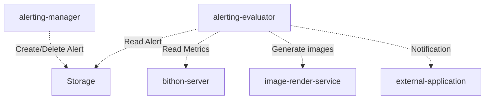

## Architecture



## Alert Object

### Template

The alert in Bithon is defined as following template in JSON.

```json
{
  "name" : "name of this alert",
  "appName" : "application owner of this alert",
  "enabled": "true/false",
  
  "evaluateInterval" : "interval for each alert evaluation. In minute",
  "matchTimes": "should alert if the conditions match up to the value of this parameter",
  
  "conditions": [{
    "id": "A-Z",
    "dataSource": "data source name of this condition",
    "dimensions": [{
      "dimension": "name of dimension",
      "matcher": {
        "type": "contains|equal|notEqual|icontains|startwith|endwith|regex|antPath|in",
        "pattern": "target value"
      }
    }],
    "metric": {
      "comparator": ">|>=|<=|<|mom-up|mom-down|dod-up|dod-down",
      "name": "metric name",
      "aggregator": "avg|count|sum|min|max|rate",
      "expected": "expected value of object.",
      "window": "the metric aggregating window from the time point when the alert is evaluating to past N minutes"
    }
  }],
  "rules": [{
    "expression": "A",
    "enabled": "true/false",
    "severity": "CRITICAL/SEVERE/MODERATE"
  }],
  "notifications": [{
    "type": "ding|console|http"
  }]
}
```

### Example

There are some Scratch Files under [this](admin/src/test/java) directory. You can directly run these scratch files in Intellij to see how the APIs work.
