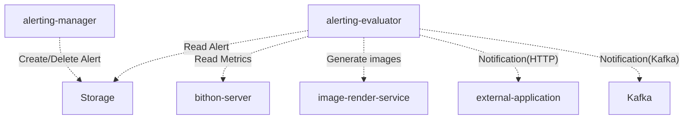
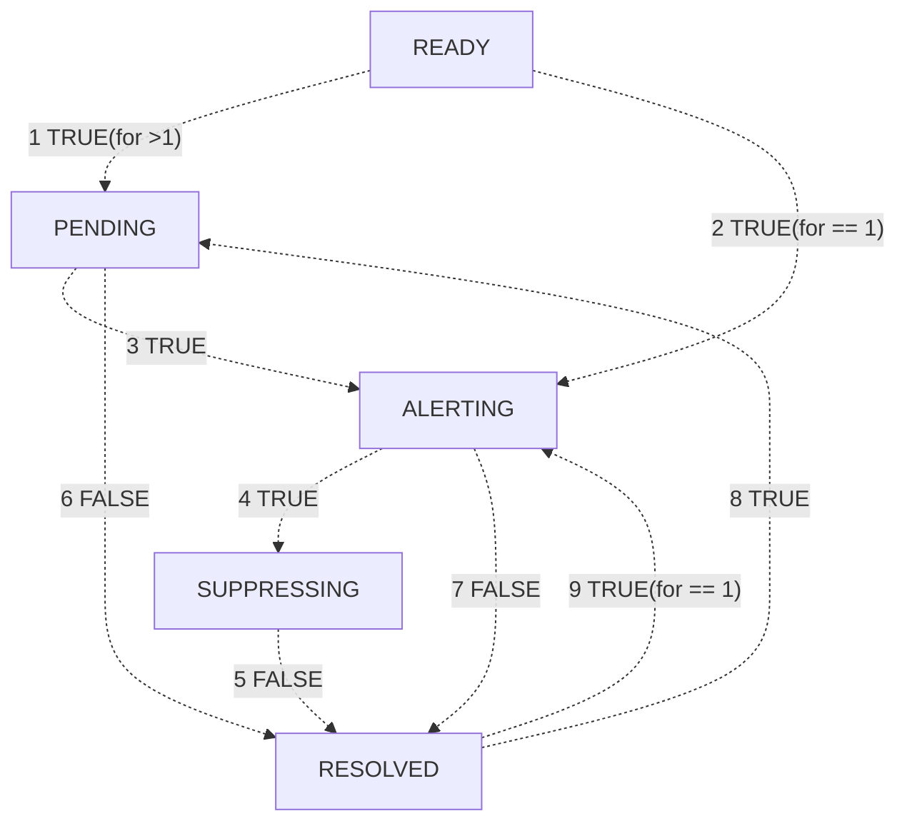

## Architecture



## Alert Status

- READY
- PENDING
- ALERTING
- SUPPRESSING
- RESOLVED



## Alert Status under the 'by' semantics

- Each series has its own status
    - READY | RESOLVED --> PENDING: **ANY** series is PENDING
    - READY | RESOLVED --> ALERTING: **ANY** series is ALERTING
    - PENDING --> ALERTING: **ANY** series is ALERTING
    - ALERTING --> SUPPRESSING: **ALL** series are SUPPRESSING
    - SUPPRESSING --> RESOLVED: **ALL** series are RESOLVED
    - ALERTING --> RESOLVED: **ALL** series are RESOLVED
    - PENDING --> RESOLVED: **ALL** series are RESOLVED

### Rules

```sql
-- ALLOWED
sum(datasource.metric_a) > 1
AND
sum(datasource.metric_b) > 1
```

```sql
-- ALLOWED, since the BY labels are the same
sum(datasource.metric_a) by (dim1, dim2) > 1
AND
sum(datasource.metric_b) by (dim1, dim2) > 1
```

```sql
-- ALLOWED, since the BY labels are the same
sum(datasource.metric_a) by (dim1, dim2) > 1
AND
sum(datasource.metric_b) > 1
```

```sql
-- NOT Allowed, since the BY labels are different
-- 
sum(datasource.metric_a) by (dim1, dim2) > 1
AND | OR
sum(datasource.metric_b) by (dim2, dim3) > 1
```

## Alert Rule Model

### Template

The alert in Bithon is defined as the following template in YAML.

```yaml
id: "f7f87ce1e0b444919b123849f4c7939f"
checkApplication: "false"
appName: "optional, the name of application that the alert belongs to"

name: "the name of the alert"
expr: "PromQL style expression, for example: avg(jvm-metrics.processCpuLoad)[1m] > 0.1[-1h]"
for: "The duration before the alert should be fired. In the format of duration. Like 1m, 1h"
every: "Optional, the interval of evaluation in minutes"
notificationProps:
  channels: [name list of notification channels]
```

### Expression Syntax

```text
expression: aggregator(datasource.metric{dim1='val1' AND dim2='val2'})[duration] op expected_value
aggregator: 'sum'|'avg'|'min'|'max'|'first'|'last'|'count'
duration: number 's'|'m'|'h'|'d'
op: '>'|'>='|'<'|'<='|'<>'|'='
expected_value: number | percentage
percentage: number '%'
```

### Example

There are some Scratch Files under the [manager module](manager) directory. 
You can directly run these scratch files in Intellij to see how the APIs work.


###

AlertExpressionEvaluator

output:

```json
{
  "outputs": [
    {
      "label": {
        "name": [],
        "values": [],
        "text" : "serialized-label"
      },
      "expected": 0.1,
      "actual": 0.1,
      "delta": 0.0
    }
  ]
}
```