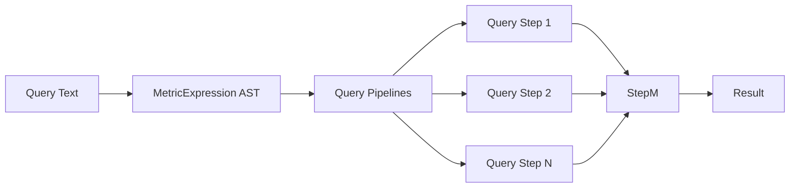
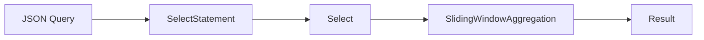

This directory holds modules that provides querying capabilities to both internal and internal storages.

Supported query:
- JSON-based query which is friendly to FE
- Metric Query Language(mql) which is a Prometheus-like query which is friendly to people

JSON Query:

## Internal Implementation

Metric Query Language:

For each step, it can be an arithmetic operation, a function call, or a subquery. 
The result of each step is passed to the next step until the final result is obtained.

If a step is a sub query, it's a JSON-based query, which is also a pipeline:

- SlidingWindowAggregation is optional
