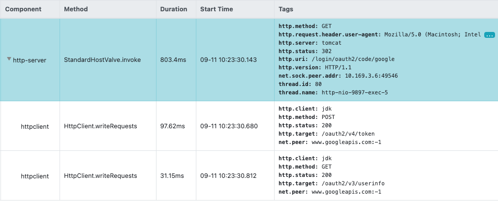
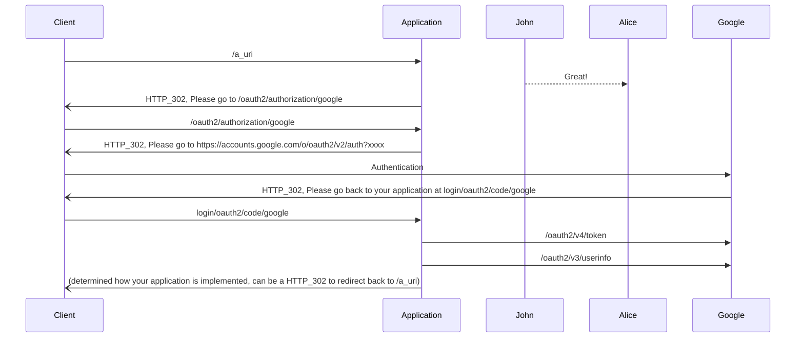

# How the OAuth2 in Spring Security works

## What happens when a new request comes
The Spring Security will install the following filters once it's enabled.

```
WebAsyncManagerIntegrationFilter
SecurityContextPersistenceFilter
HeaderWriterFilter
CsrfFilter
LogoutFilter
OAuth2AuthorizationRequestRedirectFilter
OAuth2LoginAuthenticationFilter
UsernamePasswordAuthenticationFilter
RequestCacheAwareFilter
SecurityContextHolderAwareRequestFilter
AnonymousAuthenticationFilter
SessionManagementFilter
ExceptionTranslationFilter
FilterSecurityInterceptor
```
When a fresh new HTTP incoming request comes, and if goes through all filters above.
In the `AnonymousAuthenticationFilter` filter, an `AnonymousAuthenticationToken` authentication token is generated,
and when the request comes to the last filter `FilterSecurityInterceptor`,
`org.springframework.security.access.AccessDeniedException` exception is thrown from the below stacks
since authentication is configured to be required for Spring Security.

```bash
org.springframework.security.access.vote.AffirmativeBased.decide
org.springframework.security.access.intercept.AbstractSecurityInterceptor.beforeInvocation
org.springframework.security.web.access.intercept.FilterSecurityInterceptor.invoke
org.springframework.security.web.access.intercept.FilterSecurityInterceptor.doFilter
```
Once the exception is thrown, it will be propogated backward to filters before `FilterSecurityInterceptor` one by one.
The first filter that is going to handle such exception is `ExceptionTranslationFilter`.
In this filter, the `AccessDeniedException` exception is caught and handled.

```java
else if (exception instanceof AccessDeniedException) {
	Authentication authentication = SecurityContextHolder.getContext().getAuthentication();
	if (authenticationTrustResolver.isAnonymous(authentication) || authenticationTrustResolver.isRememberMe(authentication)) {
		logger.debug(
				"Access is denied (user is " + (authenticationTrustResolver.isAnonymous(authentication) ? "anonymous" : "not fully authenticated") + "); redirecting to authentication entry point",
				exception);

		sendStartAuthentication(
				request,
				response,
				chain,
				new InsufficientAuthenticationException(
					messages.getMessage(
						"ExceptionTranslationFilter.insufficientAuthentication",
						"Full authentication is required to access this resource")));
	}
```

And in the `sendStartAuthentication`, Spring Security by default will redirect to the login URL to ask users to sign-in.
If the OAuth2 for Google is enabled, the redirect path will be `/oauth2/authorization/google`.

## Processing of `/oauth2/authorization/google`

When the client receives the redirection directive, it sends a new HTTP request with this path to the HTTP server.
For this specific path,
the pre-installed security filter `OAuth2AuthorizationRequestRedirectFilter` intercepts the request,
and then first saves(by default it's saved in current HTTP session) the authorization request that will be sent to the Google OAuth server,
and again, ask the client side browser to redirect the Google OAuth server.

The redirect URL looks like this:

```
https://accounts.google.com/o/oauth2/v2/auth?response_type=code&client_id=<CLIENT_ID>&scope=email%20profile&state=RpTchiL8rnPNo5uShYjgViG47lhGwbbjC1LLYHIhyXE%3D&redirect_uri=http://localhost:9897/login/oauth2/code/google
```

Note that in above URL, there's a redirect_uri parameter which tells Google where to redirect if the sign-in completes.

## Authentication at Google

When the client receives the redirect HTTP response again,
this time redirect to the Google OAuth server to authentication.

When the sign-in at Google completes,
Google OAuth server tells the client side browser to redirect to the URL given in above url parameter.
In this example, it's `http://localhost:9897/login/oauth2/code/google`.

> NOTE:
> 
> The default redirect URL can be customized by calling the `loginProcessUrl` method.
> 
> ```java          
> @Configuration
> @EnableWebSecurity
> public class SecurityConfiguration extends WebSecurityConfigurerAdapter {
>   @Override
>   protected void configure(HttpSecurity http) {
>       http.csrf()
>           .disable()
>           .oauth2Login().loginProcessingUrl("/oauth2/callback").permitAll();
>   }
> }
> ```

## Login

The `login/oauth2/code/google` is also a special route that will be intercepted by the `OAuth2LoginAuthenticationFilter`.

In this filter,
it first checks if the received URL parameters in this request matches the authorization request
that is saved when `/oauth2/authorization/google` is processed.

If it matches, this filter will send requests to Google for token and user information.


And then generates a `OAuth2AuthenticationToken` token and stores it in current
`SecurityContextHolder` so that the following security filters know this request has been authenticated.

# Summary

The following diagram shows the full picture of the sequences. 



# How the JWT works together with Google OAuth2

We use JWT above the Google OAuth2 for flexible and stateless permission control.
Here's how the JWT works together with Google OAuth2.

When the `Login` above completes, a JWT token is generated and written to the cookie in the HTTP response.
And also a JWT token authentication filter is installed before the `OAuth2AuthorizationRequestRedirectFilter` filter.
If the JWT token passed from a client in the HTTP request cookie is valid,
current request will be marked as authenticated by setting the `SecurityContextHolder`.

Since there's a valid authentication in current context,
the last security filter `FilterSecurityInterceptor` will not throw the `AccessDeniedException`,
and the login process will not be triggered.